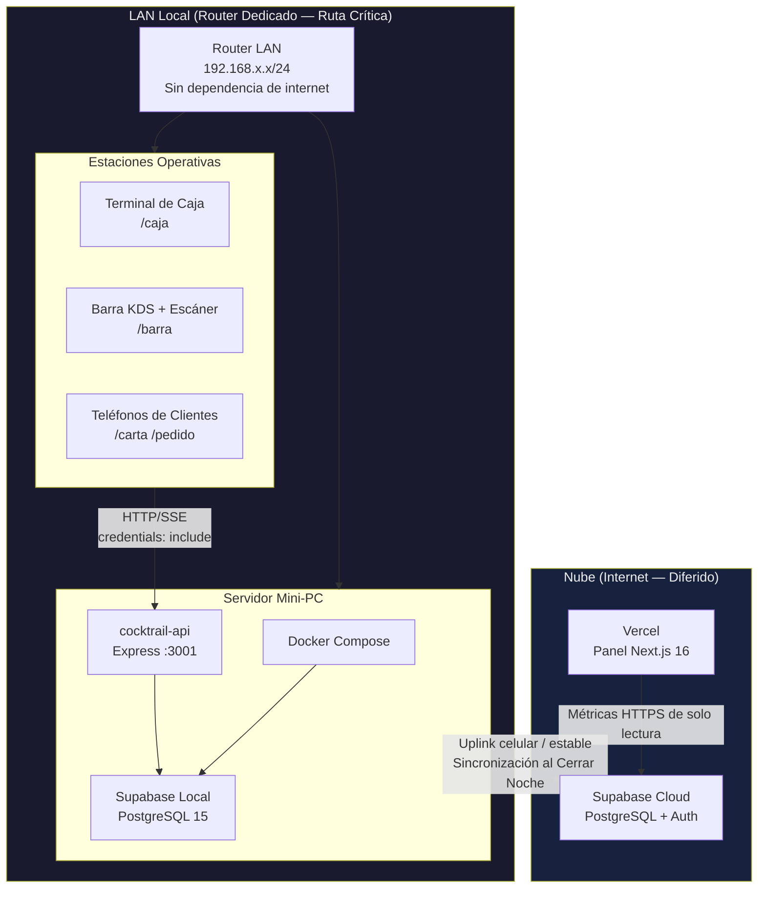
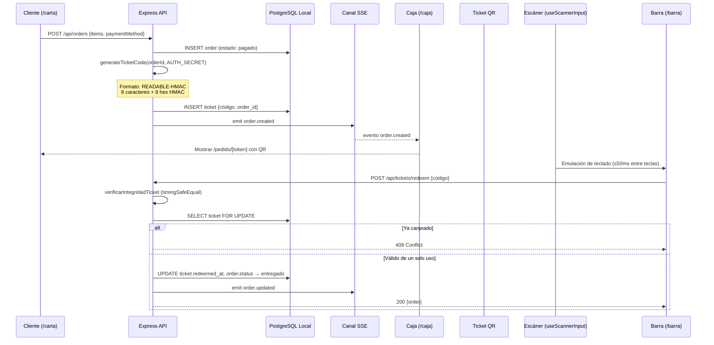
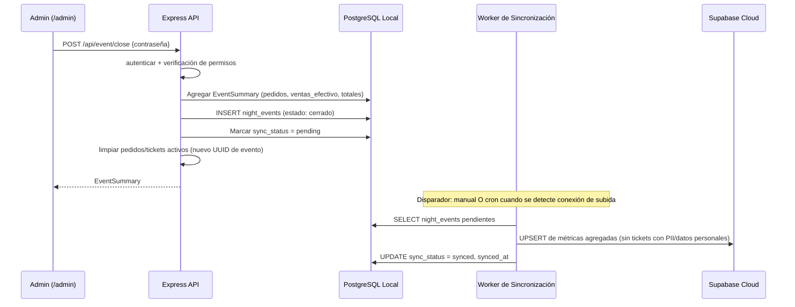
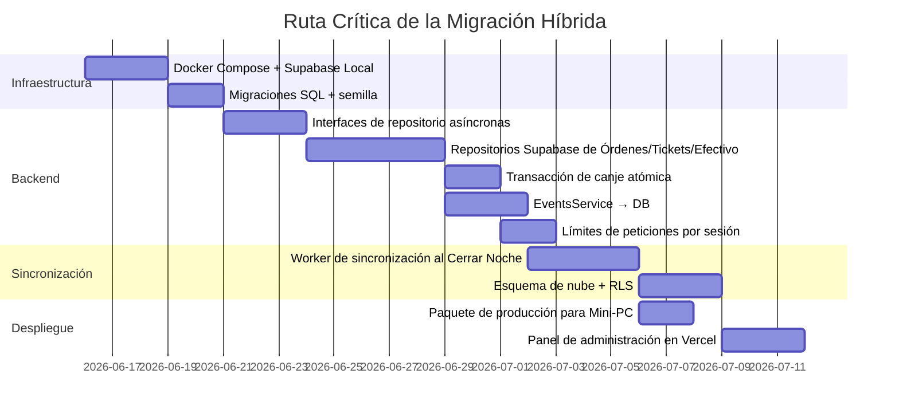

# Cocktrail — Plan de Arquitectura Híbrida

> **Versión**: 1.0  
> **Fecha**: 15 de junio de 2026  
> **Estado**: Especificación de la arquitectura objetivo + auditoría de preparación para el despliegue  
> **Alcance**: Operaciones LAN offline-first con sincronización diferida a Supabase Cloud; panel del propietario alojado en Vercel

---

## 1. Resumen Ejecutivo

Cocktrail es un sistema de punto de venta (POS) y pedidos para clubes nocturnos que opera bajo un modelo **Híbrido de Red (Network Hybrid)**:

| Zona | Rol | Entorno de Ejecución (Runtime) |
|------|-----|--------------------------------|
| **LAN Local (On-site)** | Ruta crítica: Caja, Barra, canje de tickets, SSE en tiempo real | Mini-PC (Express API + PostgreSQL local) |
| **Nube (Cloud - diferida)** | Métricas agregadas de la noche, analíticas del propietario, reportes históricos | Vercel (Next.js) + Supabase Cloud |

**Estado actual**: Monorrepisitorio con una API Express (`apps/api`) y un frontend Next.js (`apps/web`). La persistencia es en memoria (`Map`) con logs de auditoría en JSON parciales. Sin integración con Supabase, sin Docker, sin worker de sincronización en la nube. Existen interfaces de repositorio, pero solo se cablean las implementaciones en memoria/JSON en `app.ts`.

**Estado objetivo**: Supabase local (Docker) como sistema de registro principal durante las operaciones; la sincronización con la nube se activa al "Cerrar Noche" (Close Night) o mediante un worker en segundo plano cuando haya internet disponible.

---

## 2. Topología del Sistema

### 2.1 Disposición Física y de Red



### 2.2 Mapa de Componentes Lógicos

```
Cocktrail/                          (pnpm monorrepisitorio)
├── packages/shared/                  @cocktrail/shared — tipos de dominio
├── apps/api/                         backend exclusivo para LAN (Mini-PC)
│   ├── modules/
│   │   ├── orders/                   OrdersRepository → Supabase (objetivo)
│   │   ├── tickets/                  QR con HMAC + canje
│   │   ├── events/                   Ciclo de vida de la noche + Cerrar Noche
│   │   ├── auth/                     Cookies de sesión con HMAC
│   │   └── sync/                     [NO IMPLEMENTADO] Worker de subida a la nube
│   └── shared/sse/                   EventEmitter en proceso → SSE
└── apps/web/                         Despliegue dividido
    ├── /caja, /barra, /carta         Servido desde Next.js en LAN O exportación estática al Mini-PC
    └── /admin (metrics, historial)   Despliegue en Vercel (lee de Supabase Cloud)
```

### 2.3 División del Despliegue

| Superficie (Frente) | Host | Fuente de Datos | Requisito de Latencia |
|---------------------|------|-----------------|-----------------------|
| `/caja`, `/barra`, `/carta`, `/pedido/[token]` | LAN (Mini-PC o Next.js limitado a LAN) | PostgreSQL Local | < 200 ms validación de ticket |
| `/admin` metrics, historial, analytics | Vercel | Supabase Cloud (agregados sincronizados) | Segundos aceptable |
| `/api/*` (Express) | Solo Mini-PC | PostgreSQL Local | Sub-200 ms para canje |
| SSE `/api/events` | Solo Mini-PC | Emisor en proceso | TCP persistente a clientes LAN |

**Restricción**: Vercel no puede alojar la API de Express ni el flujo SSE para las operaciones locales. El rewrite de `next.config.ts` hacia `localhost:3001` es exclusivo para desarrollo y se rompe en producción.

---

## 3. Flujo de Datos

### 3.1 Flujo desde Pedido hasta Entrega



### 3.2 Cerrar Noche → Sincronización en la Nube (Objetivo)



**Brecha actual**: `EventsService.closeEvent()` realiza la agregación en memoria, añade al arreglo `closedEvents[]` (límite 60), limpia los repositorios — sin persistencia en base de datos, sin worker de sincronización y sin seguimiento de `sync_status`.

### 3.3 Ciclo de Vida de las Entidades

| Entidad | Creada | Validada | Sincronizada a la Nube |
|---------|--------|----------|------------------------|
| `orders` | POST `/api/orders` | FSM de estado localmente | Totales agregados solo al Cerrar Noche |
| `tickets` | Creación de pedido (código HMAC) | POST `/api/tickets/redeem` | Nunca (solo local, datos adyacentes a PII) |
| `cash_sales` | POST `/api/cash-sales` | Validación de evento activo | Agregadas al Cerrar Noche |
| `night_events` | Arranque de servidor / cierre previo | Contraseña de Cerrar Noche | Fila de resumen completa |
| `users`, `drinks`, `config` | CRUD de Admin | JSON local hoy → objetivo BD | Captura de configuración opcional |

---

## 4. Mecanismos de Seguridad Centrales

### 4.1 Códigos de Ticket con HMAC

**Formato**: `{READABLE}-{SIGNATURE}` — 8 caracteres alfanuméricos (juego de caracteres seguro contra confusiones visuales) + 8 caracteres hexadecimales del HMAC-SHA256 truncado.

**Generación** (`apps/api/src/modules/tickets/tickets.crypto.ts`):

```typescript
HMAC-SHA256(secret, `${orderId}:${readable}`).hex.slice(0, 8)
```

**Flujo de validación** (objetivo: < 200 ms de extremo a extremo):

1. Analizar la estructura del código (rechazar los malformados antes de la búsqueda en BD — anti-enumeración).
2. `verifyTicketIntegrity()` mediante `timingSafeEqual` sobre los buffers de firma.
3. Búsqueda en la BD por `code` o por el prefijo legible de 8 caracteres.
4. Verificación de un solo uso: `redeemed_at IS NULL`.
5. Expiración: 6 horas desde `created_at`.
6. Actualización atómica: canje de ticket + estado del pedido en una sola transacción.

**Brecha actual**: Pasos 1 al 5 implementados en memoria; el paso 6 es no atómico (carrera de tipo read-check-write entre dos escaneos concurrentes).

### 4.2 Autenticación de Sesión

**Mecanismo**: Cookie firmada con HMAC-SHA256 `cocktrail_session` = `{role}.{username}.{expiresAt}.{sig}`.

| Capa | Implementación | timingSafeEqual |
|------|----------------|-----------------|
| API de Express | `auth.service.ts` — Node `crypto` | Sí |
| Middleware de Next.js | `middleware.ts` — Web Crypto API (Edge) | No (comparación de strings `!==`; compromiso documentado) |

**Parámetros de la cookie**: `HttpOnly`, `SameSite=Strict`, `Secure` en producción.

**Restricciones de middleware en el Edge (Vercel)**:
- Se ejecuta en el Edge Runtime de forma predeterminada — compatible con `crypto.subtle`.
- Requiere `COCKTRAIL_AUTH_SECRET` o `AUTH_SECRET` en las variables de entorno de Vercel (no `NEXT_PUBLIC_*`).
- El secreto por defecto para desarrollo en el middleware es un **bloqueador de producción** si la variable no está definida.
- La autenticación por cookies cross-origin falla si el panel está en `*.vercel.app` y la API en una IP de la LAN — la división híbrida requiere que el panel de la nube use Supabase Auth/JWT, no cookies de sesión de la LAN.

### 4.3 Límites de Peticiones (Rate Limiting) y Bloqueo (Actual vs Objetivo)

#### Estado Actual (`apps/api/src/shared/middleware/rate-limit.ts`)

| Limitador | Ámbito | Ventana | Máximo (prod) |
|-----------|--------|---------|---------------|
| `generalLimiter` | IP | 15 min | 600 |
| `loginLimiter` | IP | 15 min | 1000 |
| `orderLimiter` | IP | 1 min | 15 |
| `ticketLimiter` | IP | 1 min | 45 |

La mitigación de fuerza bruta en el inicio de sesión utiliza un **captcha basado en IP** después de 3 fallos (`auth.service.ts` `captchaRegistry`), no un enfriamiento exponencial basado en la sesión.

#### Estado Objetivo (Arquitectura Híbrida)

| Vector | Estrategia | Razón de ser / Justificación |
|--------|------------|------------------------------|
| Fuerza bruta en escaneo de tickets | Ventana deslizante basada en sesión + enfriamiento exponencial | La LAN comparte una sola IP NAT; bloquear por IP dejaría fuera a toda la barra |
| Fuerza bruta en login | Bloqueo exponencial por sesión del nombre de usuario (30s → 60s → 120s → 5min) | Mismo problema de NAT; captcha como medida secundaria |
| Spam de pedidos | Se retiene el limitador por IP para clientes anónimos de `/carta` | Los clientes son dispositivos externos, por lo que la IP es representativa |
| Canje de tickets | Por sesión: base de 45/min; 3 HMAC inválidos → enfriamiento de 30s que se duplica | Protege contra el sondeo del oráculo HMAC sin bloquear a otros terminales |

**Requisito de implementación**: Reemplazar el almacén por IP de `express-rate-limit` por un almacén consciente de las sesiones con clave en `req.session.username` (post-autenticación) o firma/huella digital del dispositivo para `/barra`.

```typescript
// Interfaz objetivo (no implementada)
interface SessionRateLimitStore {
  increment(key: string): { count: number; resetAt: number };
  lockout(key: string, durationMs: number): void;
  isLocked(key: string): boolean;
}
```

### 4.4 Controles Adicionales

| Control | Estado |
|---------|--------|
| Helmet + CSP | Implementado (`app.ts`) |
| CORS LAN whitelist | Implementado (regex para RFC1918) |
| Zod payload validation | Implementado |
| AUTH_SECRET min 32 chars, prod fail-fast | Implementado (`env.ts`) |
| Row-level ticket uniqueness | **No implementado** (requiere restricción `UNIQUE` en la BD + transacción) |
| Audit log for redemptions | Solo en consola en formato JSON |
| RLS on Supabase Cloud | **No implementado** |

---

## 5. Persistencia Local — Esquema Objetivo

Esquema PostgreSQL mínimo para Supabase Local (alineado con `packages/shared/src/domain.ts`):

```sql
-- night_events: una fila por noche operativa
CREATE TABLE night_events (
  id            UUID PRIMARY KEY,
  status        TEXT NOT NULL CHECK (status IN ('activo', 'cerrado')),
  started_at    TIMESTAMPTZ NOT NULL,
  closed_at     TIMESTAMPTZ,
  order_counter INT NOT NULL DEFAULT 0,
  sync_status   TEXT DEFAULT 'pending' CHECK (sync_status IN ('pending', 'synced', 'failed')),
  synced_at     TIMESTAMPTZ
);

CREATE TABLE orders (
  id              UUID PRIMARY KEY,
  event_id        UUID REFERENCES night_events(id),
  token           TEXT NOT NULL,
  display_number  INT NOT NULL,
  items           JSONB NOT NULL,
  total           INT NOT NULL,
  payment_method  TEXT NOT NULL,
  status          TEXT NOT NULL,
  created_at      TIMESTAMPTZ NOT NULL,
  ready_at        TIMESTAMPTZ,
  delivered_at    TIMESTAMPTZ,
  ticket_code     TEXT,
  created_by      TEXT,
  cancelled_by    TEXT,
  cancelled_at    TIMESTAMPTZ
);

CREATE TABLE tickets (
  id          UUID PRIMARY KEY,
  order_id    UUID UNIQUE REFERENCES orders(id),
  code        TEXT UNIQUE NOT NULL,
  created_at  TIMESTAMPTZ NOT NULL,
  redeemed_at TIMESTAMPTZ,
  redeemed_by TEXT
);

CREATE INDEX idx_tickets_code_active ON tickets (code) WHERE redeemed_at IS NULL;
CREATE INDEX idx_orders_event_status ON orders (event_id, status);

-- Canje atómico (objetivo)
-- UPDATE tickets SET redeemed_at = NOW(), redeemed_by = $2
--   WHERE code = $1 AND redeemed_at IS NULL
--   RETURNING order_id;
-- Luego actualizar el estado del pedido en la misma transacción.
```

---

## 6. Auditoría de Preparación para el Despliegue

### 6.1 Matriz de Preparación

| Capacidad | Requerida para Híbrido | Estado Actual | Nivel de Bloqueo |
|-----------|------------------------|---------------|------------------|
| `SupabaseOrdersRepository` | Sí | **No implementado** (especificación solo en `cocktrail_architecture_guide.md`) | 🔴 Crítico |
| Supabase Local Docker | Sí | **Sin `docker-compose.yml`, sin configuración de CLI de Supabase** | 🔴 Crítico |
| `@supabase/supabase-js` dependency | Sí | **Ausente en `apps/api/package.json`** | 🔴 Crítico |
| Async repository interfaces | Sí | **Todos los repositorios son síncronos** (`Order`, no `Promise<Order>`) | 🔴 Crítico |
| Atomic ticket redemption | Sí | Read-check-write en memoria | 🔴 Crítico |
| Cloud sync worker | Sí | **No implementado** | 🔴 Crítico |
| `night_events` DB persistence | Sí | En memoria (`EventsService.event`) | 🟠 Alto |
| Closed events history | Sí | Arreglo en memoria (límite 60) | 🟠 Alto |
| Tickets/cash-sales Supabase repos | Sí | Solo en memoria | 🟠 Alto |
| Session-based rate limiting | Sí | Solo basado en IP | 🟠 Alto |
| Env vars for Supabase | Sí | Sin `SUPABASE_URL` ni `SUPABASE_SERVICE_ROLE_KEY` en `env.ts` | 🟠 Alto |
| SQL migrations | Sí | Ninguna en el repositorio | 🟠 Alto |
| LAN frontend config | Sí | `NEXT_PUBLIC_API_URL` documentado; el rewrite es solo para desarrollo | 🟡 Medio |
| Vercel project config | Sí | Sin `vercel.json`, sin configuración de despliegue en la raíz | 🟡 Medio |
| Cloud auth for Vercel admin | Sí | La autenticación por cookies de LAN es incompatible en dominios cruzados (cross-domain) | 🟡 Medio |
| Health check / monitoring | Recomendado | `/health` existe | 🟢 Listo |
| HMAC ticket crypto | Sí | Implementado con `timingSafeEqual` | 🟢 Listo |
| SSE real-time | Solo LAN | Implementado (en proceso) | 🟢 Listo (LAN) |
| Repository DI pattern | Sí | Cableado en `app.ts` | 🟢 Listo |
| Shared domain types | Sí | `@cocktrail/shared` | 🟢 Listo |

**Preparación general**: **No desplegable** en el objetivo híbrido. Estimación para completarlo: refactorización asíncrona de repositorios + repositorios de Supabase + Docker + worker de sincronización + configuraciones de despliegue.

---

### 6.2 Bloqueadores Críticos — `globalThis`/En memoria → `SupabaseOrdersRepository`

#### Bloqueador 1: La implementación del repositorio no existe

`apps/api/src/app.ts` cablea:

```typescript
const ordersRepo = new InMemoryOrdersRepository();
const ticketsRepo = new InMemoryTicketsRepository();
const cashSalesRepo = new InMemoryCashSalesRepository();
```

`SupabaseOrdersRepository` está documentado en `cocktrail_architecture_guide.md` pero tiene **cero archivos de código fuente**. Todos los servicios (`OrdersService`, `TicketsService`, `EventsService`) dependen de interfaces síncronas.

#### Bloqueador 2: Contrato de interfaz síncrono

```typescript
// apps/api/src/modules/orders/orders.repository.ts (actual)
create(order: Order): Order;
findById(id: string): Order | undefined;
```

El cliente JS de Supabase es asíncrono. La migración requiere:
- **Opción A (recomendada)**: Interfaces asíncronas + propagación de `await` a través de servicios y controladores.
- **Opción B**: Envoltorio (wrapper) de estilo síncrono con un pool de conexiones (`pg`) — puentea el cliente de Supabase y pierde los ayudantes de RLS.

Todos los controladores usan manejadores síncronos hoy en día; Express 5 soporta la propagación de errores asíncronos pero los manejadores deben ser actualizados.

#### Bloqueador 3: La persistencia parcial crea una falsa sensación de seguridad

`InMemoryOrdersRepository` escribe copias de auditoría en `orders-log.json` pero:
- El estado activo reside en un `Map` (se pierde al reiniciar).
- `findById` recurre al log JSON, lo cual es inconsistente con `list()` y `findActive()`.
- No existe un vínculo transaccional entre órdenes y tickets.

#### Bloqueador 4: Canje de tickets no atómico

`TicketsService.redeemTicket()` realiza actualizaciones secuenciales en memoria. Bajo escaneos concurrentes, el doble canje es posible. Una transacción PostgreSQL `UPDATE ... WHERE redeemed_at IS NULL RETURNING` es obligatoria antes de producción.

#### Bloqueador 5: El estado de EventsService es efímero

```typescript
// apps/api/src/modules/events/events.service.ts
private event: NightEvent;
private closedEvents: EventSummary[] = [];
```

El reinicio del servidor a mitad de la noche pierde el contexto del evento, el contador de órdenes y el historial. `closeEvent()` llama a `ordersRepo.clear()`, lo cual es incompatible con una pista de auditoría respaldada por base de datos a menos que se use archivado lógico (soft-archived).

#### Bloqueador 6: Falta de andamiaje de infraestructura

- Sin directorio `supabase/` (migraciones, `config.toml`).
- Sin Docker Compose para `supabase start`.
- Sin entradas en el esquema de env para la conexión de base de datos.
- Sin módulo de sincronización ni claves de idempotencia para la subida a la nube.

#### Bloqueador 7: Dependencia circular en la inyección de dependencias (DI)

`app.ts` declara `ordersService` antes de `ticketsService` pero pasa `ticketsService.generateForOrder` mediante una clausura perezosa (lazy closure). Los repositorios de Supabase deben preservar este orden o utilizar una fábrica o contenedor de DI.

---

### 6.3 Restricciones de Despliegue en Vercel

#### Next.js 16 + Tailwind v4

| Elemento | Versión | Soporte de Vercel |
|----------|---------|-------------------|
| Next.js | 16.2.4 (`apps/web/package.json`) | Soportado |
| React | 19.2.4 | Soportado |
| Tailwind CSS | v4 (`@tailwindcss/postcss`) | Soportado mediante el pipeline de PostCSS (`postcss.config.mjs`) |
| shadcn/ui | v4 | Compatible |

**Comando de construcción**: `pnpm --filter cocktrail-app build` desde la raíz del monorrepisitorio. Configurar el directorio raíz en Vercel a `apps/web` o utilizar el filtro de Turbo/pnpm en la configuración del proyecto.

#### Edge Middleware (`apps/web/src/middleware.ts`)

| Aspecto | Evaluación |
|---------|------------|
| Compatible con Edge Runtime | ✅ Sí, utiliza `crypto.subtle` — seguro para Edge |
| Node.js `crypto` / `Buffer` | ✅ No se utiliza en el middleware |
| `timingSafeEqual` | ⚠️ Utiliza `sig !== expected` — aceptable para Edge; documentar como limitación conocida |
| Secreto de desarrollo por defecto | 🔴 Debe eliminarse o fallar de forma segura (fail-closed) en el entorno de producción de Vercel |
| Alcance del Matcher | `/admin`, `/caja`, `/barra`, `/login` — todos protegidos |

**Requisito de producción**: Configurar `COCKTRAIL_AUTH_SECRET` en Vercel (reflejando el `AUTH_SECRET` de la LAN). Para el panel de administración alojado en Vercel que lee datos de la nube, migrar a **Supabase Auth JWT** validado en el middleware — las cookies HMAC de la LAN no pueden autenticarse contra el Supabase de la nube.

#### Limitaciones Arquitecturales de Vercel

| Característica | Vercel | Impacto |
|----------------|--------|---------|
| API Express (`apps/api`) | No puede alojar SSE de larga duración ni la BD de la LAN | La API permanece en el Mini-PC |
| rewrites de `next.config.ts` hacia `localhost:3001` | Solo en desarrollo | Los clientes de la LAN en producción deben configurar `NEXT_PUBLIC_API_URL=http://192.168.x.x:3001` |
| SSE `/api/events` | Sin conexiones persistentes a la LAN | Las vistas en tiempo real en Vercel requieren Supabase Realtime o sondeo (polling) de la BD en la nube |
| Cookies cross-origin | `SameSite=Strict` bloquea Vercel ↔ LAN | Modelos de autenticación divididos por zona de despliegue |
| Server Actions hacia la API de la LAN | Posible pero añade latencia/riesgo de fiabilidad | Preferir la comunicación directa cliente → API de la LAN en el lugar físico |

#### Alcance Recomendado para Vercel

Desplegar **únicamente** las superficies orientadas al propietario que consumen Supabase Cloud:

- Analíticas de `/admin` (post-sincronización)
- `/admin/historial` (`night_events` en la nube)
- Landing page/marketing estático si se añade

No desplegar `/caja`, `/barra`, `/carta` en Vercel para las operaciones de discoteca en producción — la latencia, el requisito de funcionamiento sin conexión (offline) y la dependencia de SSE exigen el alojamiento en la LAN.

---

### 6.4 Matriz de Preparación para Supabase Cloud

| Elemento | Estado |
|----------|--------|
| Proyecto en la nube + cadenas de conexión | No configurado |
| Esquema (subconjunto de la nube) | No definido — se recomienda usar solo tablas agregadas |
| Políticas de RLS para multi-inquilino (multi-tenant) | No implementado |
| Idempotencia de sincronización (UPSERT de `night_event_id`) | No implementado |
| Supabase Auth para el administrador de Vercel | No implementado |
| `@supabase/ssr` en Next.js | No instalado |

**Principio del esquema en la nube**: Sincronizar datos agregados (`night_event_summaries`, totales de pago, JSONB de bebidas vendidas), no tickets individuales ni tokens de clientes.

---

## 7. Secuencia de Migración



### Compuertas de fase

1. **Compuerta A**: La noche operativa local corre completamente sobre PostgreSQL; supervivencia al reinicio verificada.
2. **Compuerta B**: Prueba de escaneo concurrente de tickets — exactamente un canje tiene éxito.
3. **Compuerta C**: Cerrar Noche → la fila aparece en Supabase Cloud dentro de la ventana de conexión.
4. **Compuerta D**: El administrador de Vercel lee el historial de la nube; sin dependencia de las cookies de la LAN.

---

## 8. Variables de Entorno (Objetivo)

### Mini-PC (`apps/api/.env`)

```bash
NODE_ENV=production
PORT=3001
AUTH_SECRET=<openssl rand -hex 32>
FRONTEND_URL=http://192.168.1.10:3000
SUPABASE_URL=http://127.0.0.1:54321
SUPABASE_SERVICE_ROLE_KEY=<clave del rol de servicio local>
SUPABASE_CLOUD_URL=https://<proyecto>.supabase.co
SUPABASE_CLOUD_SERVICE_ROLE_KEY=<clave del rol de servicio de la nube — solo worker de sincronización>
SYNC_ENABLED=true
```

### LAN Frontend (`apps/web/.env`)

```bash
NEXT_PUBLIC_API_URL=http://192.168.1.10:3001
NEXT_PUBLIC_LAN_HOST=http://192.168.1.10:3000
COCKTRAIL_AUTH_SECRET=<igual que AUTH_SECRET>
```

### Vercel (`apps/web` — solo administración)

```bash
NEXT_PUBLIC_SUPABASE_URL=https://<proyecto>.supabase.co
NEXT_PUBLIC_SUPABASE_ANON_KEY=<clave pública anónima>
COCKTRAIL_AUTH_SECRET=<para middleware si se retienen rutas HMAC>
# Preferir cookies de sesión de Supabase Auth para el panel de la nube
```

---

## 9. Registro de Riesgos

| ID | Riesgo | Probabilidad | Impacto | Mitigación |
|----|--------|--------------|---------|------------|
| R1 | Fallo del disco de la Mini-PC a mitad de la noche | Media | Crítico | WAL de PostgreSQL local + copia de seguridad diaria del volumen |
| R2 | Corte de internet al Cerrar Noche | Alta | Medio | Encolar `sync_status=pending`; reintentar mediante worker |
| R3 | Carrera de doble canje de ticket | Media | Alto | Transacción de BD + índice parcial `UNIQUE` |
| R4 | Bloqueo por límite de peticiones debido a IP NAT compartida | Alta | Medio | Limitadores basados en claves de sesión (Sección 4.3) |
| R5 | Disparidad en `AUTH_SECRET` (Edge vs API) | Media | Alto | Lista de verificación para aprovisionar un único secreto |
| R6 | El administrador de Vercel muestra datos desactualizados | Media | Bajo | Indicador `synced_at` + resincronización manual |
| R7 | Rotación del secreto de los QR | Baja | Alto | Claves HMAC con versión; los tickets antiguos expiran en 6 horas |

---

## 10. Apéndice — Referencias del Código Actual

| Componente | Ruta |
|------------|------|
| Cableado de DI (en memoria) | `apps/api/src/app.ts` |
| Repositorio de órdenes | `apps/api/src/modules/orders/orders.repository.ts` |
| Criptografía HMAC de tickets | `apps/api/src/modules/tickets/tickets.crypto.ts` |
| Canje de tickets | `apps/api/src/modules/tickets/tickets.service.ts` |
| Cerrar Noche | `apps/api/src/modules/events/events.service.ts` |
| Limitadores de peticiones por IP | `apps/api/src/shared/middleware/rate-limit.ts` |
| Captcha de inicio de sesión (por IP) | `apps/api/src/modules/auth/auth.service.ts` |
| Middleware de autenticación Edge | `apps/web/src/middleware.ts` |
| Hook de entrada del escáner | `apps/web/src/hooks/useScannerInput.ts` |
| Cliente SSE | `apps/web/src/lib/useSSE.ts` |
| Tipos de dominio | `packages/shared/src/domain.ts` |

---

*Documento generado a partir de la auditoría del código del 15 de junio de 2026. Reemplaza las suposiciones operativas de `ARCHITECTURE_V2.md` para la planificación del despliegue; consulte ambos para obtener contexto histórico.*
