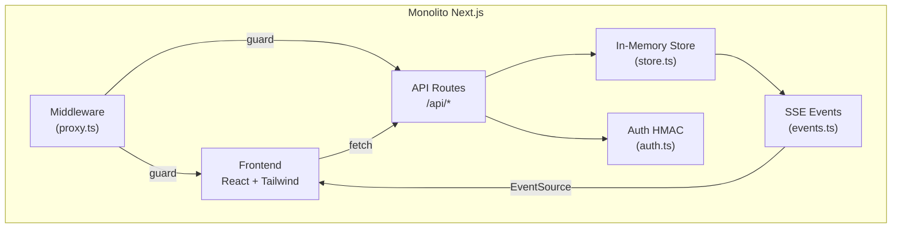
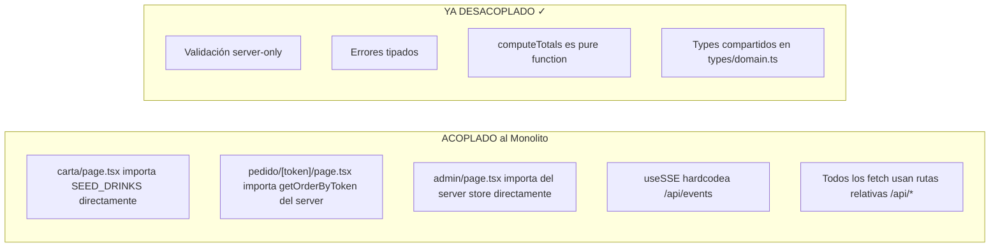
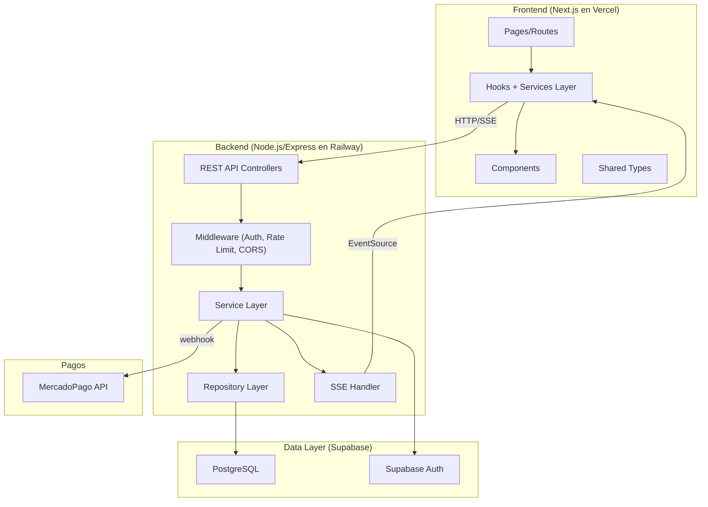
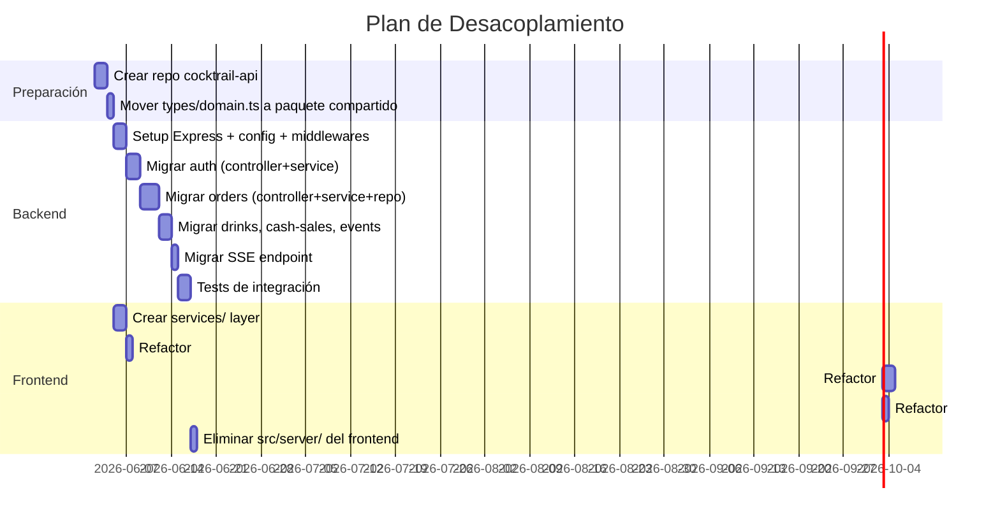
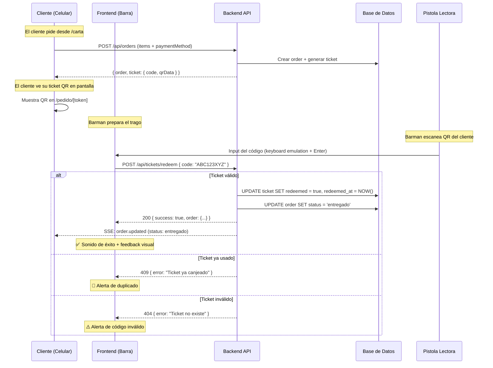
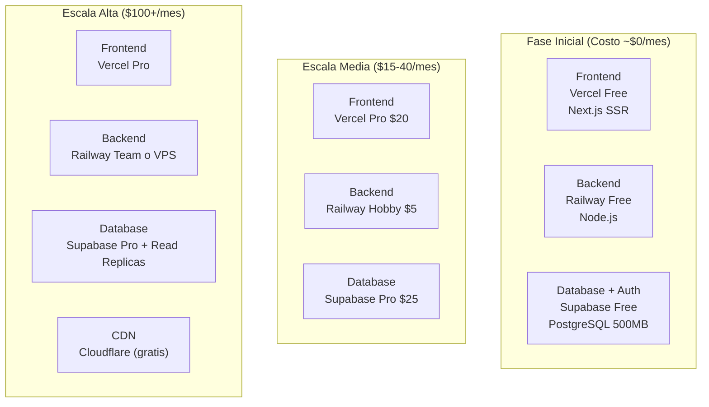
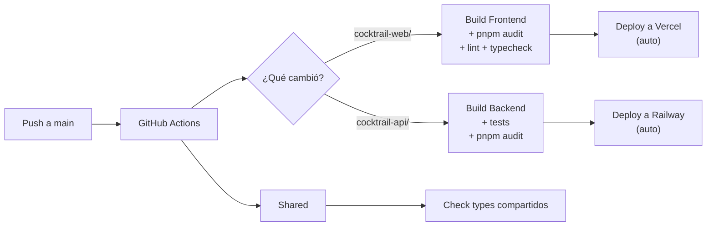
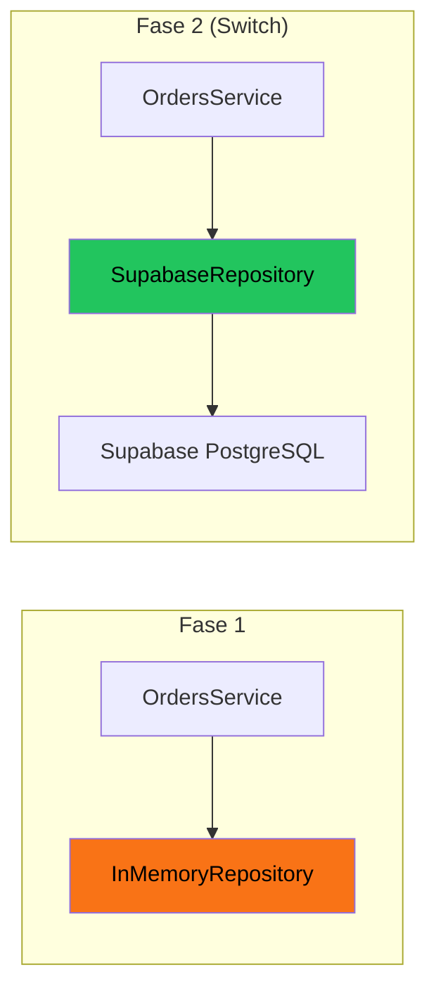
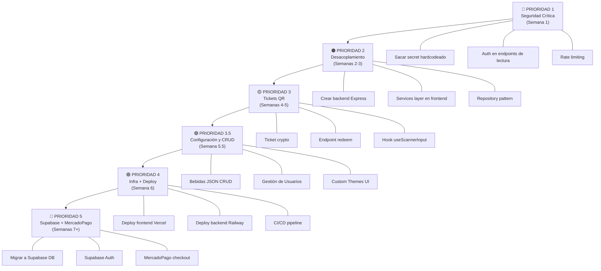

# 🏗️ Cocktrail — Guía Arquitectónica: Del MVP al Producto Profesional

> **Autor**: Análisis de Arquitectura de Software Senior + Ciberseguridad  
> **Fecha**: 31 de Mayo 2026  
> **Versión**: 1.0  
> **Basado en**: Auditoría completa del codebase actual del MVP

---

## Índice

1. [Diagnóstico del MVP Actual](#1-diagnóstico-del-mvp-actual)
2. [Fase 1: Desacoplamiento Frontend/Backend](#2-fase-1-desacoplamiento-frontendbackend)
   * [Checklist de Ejecución — Fase 1](#27-checklist-de-ejecución--fase-1-desacoplamiento)
3. [Fase 2: Security by Design](#3-fase-2-security-by-design)
   * [Checklist de Ejecución — Fase 2](#37-checklist-de-ejecución--fase-2-security-by-design)
4. [Fase 3: Sistema de Tickets QR con Validación en Pista](#4-fase-3-sistema-de-tickets-qr-con-validación-en-pista)
   * [Checklist de Ejecución — Fase 3](#48-checklist-de-ejecución--fase-3-tickets-qr)
5. [Fase 3.5: Panel de Configuración y Personalización del Boliche (CRUD & Settings)](#5-fase-35-panel-de-configuración-y-personalización-del-boliche-crud--settings)
   * [Checklist de Ejecución — Fase 3.5](#55-checklist-de-ejecución--fase-35-configuración-y-crud)
6. [Fase 4: Infraestructura y Deployment](#6-fase-4-infraestructura-y-deployment)
   * [Checklist de Ejecución — Fase 4](#67-checklist-de-ejecución--fase-4-infraestructura-y-deployment)
7. [Preparación para Integraciones Futuras (Fase 5)](#7-preparación-para-integraciones-futuras-fase-5)
   * [Checklist de Ejecución — Fase 5](#74-checklist-de-ejecución--fase-5-integraciones-supabase-y-mercadopago)
8. [Checklists Operativos](#8-checklists-operativos)

---

## 1. Diagnóstico del MVP Actual

### 1.1 Arquitectura Actual (Monolito Next.js)



### 1.2 Hallazgos Positivos ✅

| Aspecto | Detalle |
|---------|---------|
| **Validación de inputs** | `validation.ts` tiene tipado fuerte con funciones como `asString`, `asPositiveInt`, `asEnum` |
| **Manejo de errores tipado** | Clases `BadRequest`, `NotFound`, `Conflict` con mapper HTTP en `handleErrors` |
| **Estado de máquina para orders** | `STATUS_TRANSITIONS` previene transiciones inválidas (pagado→listo no es posible) |
| **Auth con HMAC-SHA256** | Cookies firmadas con `timingSafeEqual` para prevenir timing attacks |
| **SSE bien implementado** | Keep-alive, cleanup en abort, topic-based events |
| **Separación server-only** | Los módulos del server usan `import "server-only"` para que no se incluyan en bundles del client |

### 1.3 Hallazgos Críticos 🚨

| ID | Severidad | Archivo | Problema |
|----|-----------|---------|----------|
| **C1** | 🔴 CRÍTICO | [store.ts](file:///Users/matiasasin/Desktop/Dev/cocktrail/src/server/store.ts) | **Estado in-memory en `globalThis`**. No persiste entre deploys/restarts. Un crash pierde TODOS los datos de la noche |
| **C2** | 🔴 CRÍTICO | [auth.ts](file:///Users/matiasasin/Desktop/Dev/cocktrail/src/server/auth.ts#L9-L11) | **Secret hardcodeado**: `"demo-secret-do-not-deploy-as-is"`. Si la env var no está, cualquiera puede forjar sessions |
| **C3** | 🔴 CRÍTICO | [auth.ts](file:///Users/matiasasin/Desktop/Dev/cocktrail/src/server/auth.ts#L17-L20) | **Credenciales default `admin/admin`, `barman/barman`** sin forzar cambio |
| **C4** | 🟠 ALTO | [proxy.ts](file:///Users/matiasasin/Desktop/Dev/cocktrail/src/proxy.ts) | **APIs de lectura sin auth**: `GET /api/state`, `GET /api/events`, `GET /api/orders` son públicas. Cualquiera puede ver todos los pedidos y totales |
| **C5** | 🟠 ALTO | [store.ts](file:///Users/matiasasin/Desktop/Dev/cocktrail/src/server/store.ts#L86-L89) | **Token corto (8 hex = 4 bytes)**. Con ~65.000 combinaciones, colisión factible en noches de alto tráfico. Además es predecible |
| **C6** | 🟡 MEDIO | [carta/page.tsx](file:///Users/matiasasin/Desktop/Dev/cocktrail/src/app/carta/page.tsx#L10-L13) | **`SEED_DRINKS` importado directamente** en el cliente. Datos hardcodeados, no vienen del backend |
| **C7** | 🟡 MEDIO | [auth.ts](file:///Users/matiasasin/Desktop/Dev/cocktrail/src/server/auth.ts#L88-L91) | **Cookie sin flag `Secure`**. Intencionado para LAN/HTTP demo, pero necesita activarse en producción |
| **C8** | 🟡 MEDIO | General | **Sin rate limiting** en ningún endpoint. Vulnerable a brute-force en login y spam de pedidos |
| **C9** | 🟡 MEDIO | General | **Sin CORS headers** configurados. Cuando el backend sea independiente, es crítico |
| **C10** | ℹ️ INFO | [proxy.ts](file:///Users/matiasasin/Desktop/Dev/cocktrail/src/proxy.ts#L62-L63) | El middleware actúa como middleware de Next.js (debe renombrarse a `middleware.ts` en root para ser auto-registrado, actualmente se importa manualmente) |

### 1.4 Mapa de Acoplamiento



---

## 2. Fase 1: Desacoplamiento Frontend/Backend

### 2.1 Arquitectura Target



### 2.2 Estructura de Carpetas — Backend

```
cocktrail-api/
├── src/
│   ├── config/
│   │   ├── env.ts                # Validación de env vars con zod
│   │   ├── cors.ts               # Configuración CORS
│   │   └── database.ts           # Config de conexión a Supabase/PostgreSQL
│   │
│   ├── modules/                  # Organización por dominio (Feature Modules)
│   │   ├── auth/
│   │   │   ├── auth.controller.ts
│   │   │   ├── auth.service.ts
│   │   │   ├── auth.middleware.ts # Guard de JWT/Session
│   │   │   └── auth.types.ts
│   │   │
│   │   ├── drinks/
│   │   │   ├── drinks.controller.ts
│   │   │   ├── drinks.service.ts
│   │   │   ├── drinks.repository.ts  # ← Capa de datos (hoy in-memory, mañana Supabase)
│   │   │   └── drinks.types.ts
│   │   │
│   │   ├── orders/
│   │   │   ├── orders.controller.ts
│   │   │   ├── orders.service.ts
│   │   │   ├── orders.repository.ts
│   │   │   └── orders.types.ts
│   │   │
│   │   ├── tickets/               # ← NUEVO: Sistema de tickets QR
│   │   │   ├── tickets.controller.ts
│   │   │   ├── tickets.service.ts
│   │   │   ├── tickets.repository.ts
│   │   │   ├── tickets.crypto.ts  # Generación y firma de tickets
│   │   │   └── tickets.types.ts
│   │   │
│   │   ├── events/                # Night events (no SSE)
│   │   │   ├── events.controller.ts
│   │   │   ├── events.service.ts
│   │   │   └── events.repository.ts
│   │   │
│   │   ├── cash-sales/
│   │   │   ├── cash-sales.controller.ts
│   │   │   ├── cash-sales.service.ts
│   │   │   └── cash-sales.repository.ts
│   │   │
│   │   └── payments/              # ← Placeholder para MercadoPago
│   │       ├── payments.controller.ts
│   │       ├── payments.service.ts  # Interface + mock
│   │       ├── payments.webhook.ts
│   │       └── payments.types.ts
│   │
│   ├── shared/
│   │   ├── types/
│   │   │   └── domain.ts          # Tipos compartidos (se puede publicar como paquete)
│   │   ├── errors/
│   │   │   └── http-errors.ts     # BadRequest, NotFound, Conflict, Unauthorized, Forbidden
│   │   ├── middleware/
│   │   │   ├── error-handler.ts   # Catch-all global
│   │   │   ├── rate-limiter.ts    # Rate limiting por IP/user
│   │   │   ├── request-logger.ts  # Logging estructurado
│   │   │   └── validate.ts        # Validación con zod
│   │   ├── utils/
│   │   │   ├── totals.ts          # computeTotals (ya existente)
│   │   │   └── crypto.ts          # Funciones criptográficas compartidas
│   │   └── sse/
│   │       ├── sse-manager.ts     # Pub/sub centralizado
│   │       └── sse.controller.ts  # Endpoint SSE
│   │
│   ├── app.ts                     # Setup Express + middlewares
│   └── server.ts                  # Entry point
│
├── tests/
│   ├── unit/
│   └── integration/
│
├── .env.example                   # Template de env vars
├── Dockerfile
├── package.json
└── tsconfig.json
```

### 2.3 Estructura de Carpetas — Frontend

```
cocktrail-web/
├── src/
│   ├── app/                       # Next.js App Router (se mantiene)
│   │   ├── (public)/              # Route group: sin auth
│   │   │   ├── carta/page.tsx
│   │   │   ├── pedido/[token]/page.tsx
│   │   │   └── layout.tsx
│   │   ├── (auth)/                # Route group: requiere auth
│   │   │   ├── admin/
│   │   │   ├── barra/
│   │   │   └── layout.tsx         # Auth guard server-side
│   │   ├── login/page.tsx
│   │   ├── layout.tsx
│   │   ├── globals.css
│   │   └── page.tsx
│   │
│   ├── components/                # Componentes presentacionales
│   │   ├── ui/                    # Primitivos (Shadcn)
│   │   ├── ticket/
│   │   │   ├── Ticket.tsx
│   │   │   └── TicketLive.tsx
│   │   ├── drinks/
│   │   │   ├── DrinkCard.tsx
│   │   │   └── DrinkSkeleton.tsx
│   │   ├── admin/
│   │   │   ├── Kpi.tsx
│   │   │   ├── OrderRow.tsx
│   │   │   └── CloseNightModal.tsx
│   │   ├── barra/
│   │   │   ├── Column.tsx
│   │   │   └── OrderCard.tsx
│   │   └── shared/
│   │       ├── BrandLogo.tsx
│   │       ├── ThemeProvider.tsx
│   │       └── ThemeSwitcher.tsx
│   │
│   ├── services/                  # ← CAPA CLAVE: Abstracción de la API
│   │   ├── api-client.ts          # Configuración base (baseURL, interceptors, auth headers)
│   │   ├── auth.service.ts        # login(), logout(), getMe()
│   │   ├── drinks.service.ts      # listDrinks()
│   │   ├── orders.service.ts      # createOrder(), updateStatus(), getByToken()
│   │   ├── events.service.ts      # closeEvent(), getHistory()
│   │   ├── cash-sales.service.ts  # addCashSale(), list()
│   │   ├── tickets.service.ts     # validateTicket() ← NUEVO
│   │   └── payments.service.ts    # ← Placeholder para MercadoPago
│   │
│   ├── hooks/                     # React hooks
│   │   ├── useSSE.ts
│   │   ├── useAuth.ts
│   │   ├── useOrders.ts
│   │   └── useScannerInput.ts     # ← NUEVO: captura de pistola lectora
│   │
│   ├── lib/                       # Utilidades puras
│   │   ├── activeOrder.ts
│   │   ├── orderStatus.ts
│   │   ├── totals.ts
│   │   ├── utils.ts
│   │   └── icons.ts
│   │
│   ├── types/
│   │   └── domain.ts
│   │
│   └── config/
│       └── env.ts                 # NEXT_PUBLIC_API_URL, etc.
│
├── public/
├── next.config.ts
├── package.json
└── tsconfig.json
```

### 2.4 La Capa de Servicios (La Pieza Clave)

El archivo más importante del desacoplamiento es `api-client.ts`. Este centraliza TODA comunicación con el backend:

```typescript
// src/services/api-client.ts
const API_BASE = process.env.NEXT_PUBLIC_API_URL ?? '';

type RequestOptions = {
  method?: string;
  body?: unknown;
  headers?: Record<string, string>;
  signal?: AbortSignal;
};

class ApiError extends Error {
  constructor(public status: number, message: string) {
    super(message);
    this.name = 'ApiError';
  }
}

export async function apiFetch<T>(
  path: string, 
  opts: RequestOptions = {}
): Promise<T> {
  const { method = 'GET', body, headers = {}, signal } = opts;
  
  const res = await fetch(`${API_BASE}${path}`, {
    method,
    headers: {
      'Content-Type': 'application/json',
      ...headers,
    },
    body: body ? JSON.stringify(body) : undefined,
    credentials: 'include', // Envía cookies de sesión
    signal,
  });

  if (!res.ok) {
    const err = await res.json().catch(() => ({ error: 'Error desconocido' }));
    throw new ApiError(res.status, err.error ?? `HTTP ${res.status}`);
  }

  return res.json();
}
```

> [!IMPORTANT]
> **Cuando `NEXT_PUBLIC_API_URL` esté vacío** (fase de transición), los fetches irán a rutas relativas (`/api/orders`) como hoy. Cuando le pongas el dominio del backend (`https://api.cocktrail.app`), automáticamente van al servicio externo. **Cero cambios en los componentes.**

### 2.5 Patrón Repository para el Backend

Este es el patrón que te permite cambiar de in-memory a Supabase sin tocar la lógica de negocio:

```typescript
// --- Interface (contrato) ---
// modules/orders/orders.repository.ts
export interface OrdersRepository {
  create(order: Order): Promise<Order>;
  findById(id: string): Promise<Order | null>;
  findByToken(token: string): Promise<Order | null>;
  findActive(): Promise<Order[]>;
  updateStatus(id: string, status: OrderStatus): Promise<Order>;
  findByEventId(eventId: string): Promise<Order[]>;
}

// --- Implementación In-Memory (fase 1) ---
export class InMemoryOrdersRepository implements OrdersRepository {
  private orders = new Map<string, Order>();
  // ... idéntico al store.ts actual
}

// --- Implementación Supabase (fase 3) ---
export class SupabaseOrdersRepository implements OrdersRepository {
  constructor(private supabase: SupabaseClient) {}
  
  async findByToken(token: string): Promise<Order | null> {
    const { data } = await this.supabase
      .from('orders')
      .select('*')
      .eq('token', token)
      .single();
    return data;
  }
  // ...
}
```

### 2.6 Plan de Migración Paso a Paso



> [!TIP]
> **No migres todo de golpe.** Podés correr ambos en paralelo durante la transición: el frontend sigue usando las API Routes de Next.js, y vas probando contra el backend nuevo endpoint por endpoint con feature flags.

### 2.7 Checklist de Ejecución — Fase 1 (Desacoplamiento)

#### Backend
- [x] Inicializar el subproyecto `cocktrail-api` (Express + TypeScript + tsconfig + package.json)
- [x] Configurar variables de entorno iniciales en `src/config/env.ts` usando Zod para validación
- [x] Implementar la interfaz y la clase base de los repositorios (`OrdersRepository` e `InMemoryOrdersRepository`)
- [x] Migrar el módulo de autenticación: `auth.controller.ts`, `auth.service.ts`, y `auth.middleware.ts`
- [x] Migrar el módulo de órdenes: `orders.controller.ts` y `orders.service.ts`
- [x] Migrar los controladores y servicios de bebidas, ventas en efectivo y eventos de la noche
- [x] Migrar e implementar el soporte de SSE (Server-Sent Events) en `sse.controller.ts` y `sse-manager.ts`
- [x] Escribir tests de integración iniciales para validar las rutas migradas del backend

#### Frontend
- [x] Crear la capa de servicios genérica `api-client.ts` con manejo de fetch y reintentos / errores
- [x] Crear los servicios específicos: `auth.service.ts`, `drinks.service.ts`, y `orders.service.ts`
- [x] Refactorizar la página de `/carta` para consumir los datos de bebidas a través de `drinks.service.ts`
- [x] Refactorizar el panel de `/admin` y `/barra` para que consuman datos del servicio en lugar de imports directos de backend
- [x] Modificar el hook `useSSE` para conectarse dinámicamente a `NEXT_PUBLIC_API_URL`
- [x] Eliminar los módulos del servidor (`src/server/`) del proyecto frontend una vez completada y verificada la migración

---

## 3. Fase 2: Security by Design

### 3.1 Matriz OWASP Top 10 → Cocktrail

| # | OWASP 2021 | Riesgo en Cocktrail | Mitigación |
|---|-----------|---------------------|------------|
| **A01** | Broken Access Control | APIs de lectura `/api/state`, `/api/events` sin auth. Cualquiera ve pedidos y totales de la noche | Auth middleware en TODOS los endpoints. Rol-based: admin, barman, cliente (futuro) |
| **A02** | Cryptographic Failures | Secret hardcodeado. Cookie sin `Secure`. Token de 4 bytes | Secrets en env vars con validación obligatoria. `Secure; SameSite=Strict` en prod. Token de 16+ bytes con CSPRNG |
| **A03** | Injection | JSON.parse sin sanitización profunda | Validación con **zod** schemas. Escapar outputs en DB queries |
| **A04** | Insecure Design | Sin rate limiting. Sin idempotency keys en creación de pedidos | Rate limit por IP (15 req/min en login, 60 req/min general). Idempotency key en POST |
| **A05** | Security Misconfiguration | CORS no configurado. Headers de seguridad faltantes | Helmet.js. CORS whitelist explícita. `X-Content-Type-Options: nosniff` |
| **A06** | Vulnerable Components | Dependencias actualizadas ✅ (Next 16, React 19) | Mantener: `pnpm audit` en CI |
| **A07** | Auth Failures | Credenciales default. Sin lockout. Sin MFA | Forzar cambio de creds en primer login. Lockout tras 5 intentos. Supabase Auth a futuro |
| **A08** | Data Integrity Failures | Pedidos se crean sin confirmar pago real | Webhook de MercadoPago como source of truth del pago |
| **A09** | Logging & Monitoring | Solo `console.error` | Logging estructurado (pino). Alertas en errores de auth |
| **A10** | SSRF | Bajo riesgo actual | Validar URLs de imágenes si se permite upload |

### 3.2 Headers de Seguridad (Implementar desde el Día 1)

```typescript
// Backend: middleware con helmet
import helmet from 'helmet';

app.use(helmet({
  contentSecurityPolicy: {
    directives: {
      defaultSrc: ["'self'"],
      scriptSrc: ["'self'"],
      styleSrc: ["'self'", "'unsafe-inline'"], // Tailwind necesita esto
      imgSrc: ["'self'", "data:", "https://images.unsplash.com"],
      connectSrc: ["'self'", process.env.FRONTEND_URL!],
    },
  },
  crossOriginEmbedderPolicy: false, // Para SSE
}));

// CORS: solo tu frontend
app.use(cors({
  origin: process.env.FRONTEND_URL!,
  credentials: true,
  methods: ['GET', 'POST', 'PATCH', 'DELETE'],
  allowedHeaders: ['Content-Type', 'Authorization', 'X-Idempotency-Key'],
}));
```

### 3.3 Rate Limiting

```typescript
import rateLimit from 'express-rate-limit';

// General: 100 req / 15 min por IP
const generalLimiter = rateLimit({
  windowMs: 15 * 60 * 1000,
  max: 100,
  standardHeaders: true,
  legacyHeaders: false,
  message: { error: 'Demasiadas solicitudes. Intentá de nuevo en unos minutos.' },
});

// Login: 5 intentos / 15 min por IP (anti brute-force)
const loginLimiter = rateLimit({
  windowMs: 15 * 60 * 1000,
  max: 5,
  message: { error: 'Demasiados intentos de login. Esperá 15 minutos.' },
});

// Creación de pedidos: 10 / min por IP (anti-spam)
const orderLimiter = rateLimit({
  windowMs: 60 * 1000,
  max: 10,
});

// Validación de ticket: 30 / min por IP (la pistola es rápida)
const ticketLimiter = rateLimit({
  windowMs: 60 * 1000,
  max: 30,
});
```

### 3.4 Validación con Zod (Reemplaza validation.ts manual)

```typescript
import { z } from 'zod';

// Esquema para crear un pedido
export const CreateOrderSchema = z.object({
  items: z.array(z.object({
    drinkId: z.number().int().positive(),
    qty: z.number().int().positive().max(20), // ← Límite de unidades por item
  })).min(1).max(50), // ← Límite de items por pedido
  paymentMethod: z.enum(['transferencia', 'efectivo', 'qr', 'debito']),
  idempotencyKey: z.string().uuid().optional(), // ← Para prevenir pedidos duplicados
});

// Esquema para login
export const LoginSchema = z.object({
  username: z.string().min(1).max(50).trim(),
  password: z.string().min(1).max(128),
});

// Middleware genérico de validación
export function validate<T>(schema: z.Schema<T>) {
  return (req: Request, res: Response, next: NextFunction) => {
    const result = schema.safeParse(req.body);
    if (!result.success) {
      return res.status(400).json({
        error: 'Validación fallida',
        details: result.error.flatten().fieldErrors,
      });
    }
    req.body = result.data; // Body sanitizado
    next();
  };
}
```

### 3.5 Configuración Obligatoria de Env Vars

```typescript
// config/env.ts — FALLA AL BOOT si faltan variables críticas
import { z } from 'zod';

const EnvSchema = z.object({
  NODE_ENV: z.enum(['development', 'production', 'test']),
  PORT: z.coerce.number().default(3001),
  
  // Auth — SIN DEFAULTS. Obligatorio.
  AUTH_SECRET: z.string().min(32, 'AUTH_SECRET debe tener al menos 32 caracteres'),
  
  // CORS
  FRONTEND_URL: z.string().url(),
  
  // Database (Supabase — opcional en fase 1)
  SUPABASE_URL: z.string().url().optional(),
  SUPABASE_ANON_KEY: z.string().optional(),
  SUPABASE_SERVICE_KEY: z.string().optional(),
  
  // Pagos (opcional hasta integración)
  MERCADOPAGO_ACCESS_TOKEN: z.string().optional(),
  MERCADOPAGO_WEBHOOK_SECRET: z.string().optional(),
});

export const env = EnvSchema.parse(process.env);
```

> [!CAUTION]
> **El backend DEBE crashear al iniciar si `AUTH_SECRET` no está configurado.** Esto previene que se deploye con el secret hardcodeado del demo.

### 3.6 Mejora del Sistema de Sesiones

```typescript
// Evolución de auth.ts actual → JWT con rotación
import jwt from 'jsonwebtoken';

// Opción A: JWT Stateless (recomendada hasta tener Supabase Auth)
export function signToken(payload: { userId: string; role: Role }): string {
  return jwt.sign(payload, env.AUTH_SECRET, {
    expiresIn: '12h',
    issuer: 'cocktrail-api',
    audience: 'cocktrail-web',
  });
}

// Cookie de producción
export function buildSessionCookie(token: string): string {
  const maxAge = 12 * 60 * 60;
  const secure = env.NODE_ENV === 'production' ? 'Secure;' : '';
  return `cocktrail_session=${token}; HttpOnly; ${secure} Path=/; SameSite=Strict; Max-Age=${maxAge}`;
}
```

### 3.7 Checklist de Ejecución — Fase 2 (Security by Design)

#### Monolito / Backend de Transición
- [x] Eliminar secret hardcodeado en `src/server/auth.ts` y lanzar excepción al boot si no existe la env var
- [x] Configurar protección por autenticación y roles en endpoints de lectura en `src/proxy.ts` (ej. `GET /api/state`)
- [x] Configurar cookies de sesión con flags `Secure` y `SameSite=Strict` cuando esté en producción
- [x] Implementar middleware de rate limiting global y específicos para login (5 req / 15 min) y órdenes (10 req / min)
- [x] Instalar y configurar `helmet` para inyectar headers de seguridad avanzados y política de seguridad de contenido (CSP)
- [x] Definir esquemas de validación usando Zod para todos los payloads de entrada (p. ej. `CreateOrderSchema`, `LoginSchema`)
- [x] Implementar el middleware genérico `validate` para sanitizar los inputs de todas las APIs
- [x] Configurar CORS explícito permitiendo únicamente el dominio del frontend y deshabilitando wildcards

---

## 4. Fase 3: Sistema de Tickets QR con Validación en Pista

### 4.1 Arquitectura del Flujo de Tickets



### 4.2 Diseño del Ticket Seguro

```typescript
// modules/tickets/tickets.crypto.ts
import { randomBytes, createHmac } from 'node:crypto';

/**
 * Genera un código de ticket compuesto:
 * - Parte legible: 8 chars alfanuméricos (para lectura humana si falla el scanner)
 * - HMAC de integridad: 8 chars hex (para validar que no fue forjado)
 * - Formato final: "ABCD1234-a1b2c3d4"
 * 
 * El HMAC se calcula sobre: orderId + readablePart + secreto del server.
 * Esto hace que un atacante no pueda generar tickets válidos sin el secret.
 */
export function generateTicketCode(orderId: string, secret: string): string {
  // 5 bytes → 8 chars en base36 (alfanumérico, legible)
  const readable = randomBytes(5).toString('hex').slice(0, 8).toUpperCase();
  
  // HMAC de integridad (anti-forgery)
  const hmac = createHmac('sha256', secret)
    .update(`${orderId}:${readable}`)
    .digest('hex')
    .slice(0, 8);
  
  return `${readable}-${hmac}`;
}

/**
 * Valida la integridad del código antes de buscar en DB.
 * Esto previene que se hagan lookups en la base con códigos random
 * (anti-enumeration attack).
 */
export function verifyTicketIntegrity(
  code: string,
  orderId: string, 
  secret: string
): boolean {
  const [readable, hmac] = code.split('-');
  if (!readable || !hmac || readable.length !== 8 || hmac.length !== 8) {
    return false;
  }
  
  const expected = createHmac('sha256', secret)
    .update(`${orderId}:${readable}`)
    .digest('hex')
    .slice(0, 8);
  
  // Constant-time comparison
  return timingSafeEqual(
    Buffer.from(hmac, 'hex'),
    Buffer.from(expected, 'hex')
  );
}
```

> [!NOTE]
> **¿Por qué no un UUID directo?** Un UUID de 36 caracteres es largo para un QR y propenso a errores si alguien lo tipea manualmente. El formato `ABCD1234-a1b2c3d4` (17 chars) es:
> - Corto para QR → QR más pequeño → escaneo más rápido
> - Legible como fallback manual
> - Firmado con HMAC → no se puede falsificar

### 4.3 Endpoint de Redención (El más crítico del sistema)

```typescript
// modules/tickets/tickets.controller.ts

/**
 * POST /api/tickets/redeem
 * 
 * ATÓMICO: Usa una transacción de DB para garantizar que el ticket
 * se marca como canjeado Y el pedido se actualiza en la misma operación.
 * Si algo falla, se hace rollback. Esto previene race conditions donde
 * dos barmen escanean el mismo ticket al mismo tiempo.
 */
router.post('/redeem', 
  authMiddleware(['admin', 'barman']),  // Solo staff
  ticketLimiter,                         // Rate limit
  validate(RedeemTicketSchema),          // Validación
  async (req, res) => {
    const { code } = req.body;
    
    try {
      // 1. Buscar ticket en DB
      const ticket = await ticketsRepo.findByCode(code);
      
      if (!ticket) {
        return res.status(404).json({ 
          error: 'Ticket no encontrado',
          sound: 'error'  // El frontend reproduce feedback sonoro
        });
      }
      
      if (ticket.redeemedAt) {
        return res.status(409).json({
          error: `Ticket ya canjeado a las ${formatTime(ticket.redeemedAt)}`,
          redeemedAt: ticket.redeemedAt,
          redeemedBy: ticket.redeemedBy,
          sound: 'duplicate'
        });
      }
      
      // 2. Redimir en una transacción atómica
      const result = await db.transaction(async (tx) => {
        // Bloqueo pesimista: SELECT ... FOR UPDATE
        const locked = await tx.query(
          'SELECT * FROM tickets WHERE id = $1 FOR UPDATE',
          [ticket.id]
        );
        
        // Double-check después del lock (por si otro barman lo canjeó entre el check y el lock)
        if (locked.rows[0].redeemed_at) {
          throw new ConflictError('Ticket canjeado por otro barman');
        }
        
        // Marcar ticket como canjeado
        await tx.query(
          `UPDATE tickets SET 
             redeemed_at = NOW(),
             redeemed_by = $1 
           WHERE id = $2`,
          [req.user.id, ticket.id]
        );
        
        // Actualizar estado del pedido
        await tx.query(
          `UPDATE orders SET 
             status = 'entregado',
             delivered_at = NOW()
           WHERE id = $1`,
          [ticket.orderId]
        );
        
        return ticket;
      });
      
      // 3. Emitir evento SSE
      sseManager.emit({
        type: 'order.updated',
        order: { ...result.order, status: 'entregado' }
      });
      
      return res.json({
        success: true,
        order: result.order,
        sound: 'success'
      });
      
    } catch (err) {
      if (err instanceof ConflictError) {
        return res.status(409).json({ error: err.message, sound: 'duplicate' });
      }
      throw err;
    }
  }
);
```

### 4.4 Frontend: Captura de la Pistola Lectora

> [!IMPORTANT]
> **Las pistolas de código de barras emulan un teclado USB.** Cuando escanean, envían los caracteres del código como keystrokes rápidos y terminan con `Enter`. Tu frontend NO necesita drivers ni APIs especiales — solo capturar la entrada de teclado.

```typescript
// hooks/useScannerInput.ts
import { useCallback, useEffect, useRef } from 'react';

type UseScannerOptions = {
  /** Callback al recibir un scan completo */
  onScan: (code: string) => void;
  /** Tiempo máximo entre keystrokes para considerar que es un scan (ms) */
  maxKeystrokeGap?: number;
  /** Largo mínimo del código para procesarlo */
  minLength?: number;
  /** Si está habilitado el scanner */
  enabled?: boolean;
};

/**
 * Hook que captura la entrada de una pistola lectora de códigos de barras.
 * 
 * La pistola emula un teclado: envía chars rápidos (< 50ms entre cada uno)
 * y termina con Enter. Este hook distingue entre tipeo humano (lento) y
 * entrada de pistola (rápida) por la velocidad entre keystrokes.
 * 
 * CRÍTICO: No debe interferir con inputs de texto normales.
 * Solo captura cuando ningún <input>/<textarea> tiene foco.
 */
export function useScannerInput({
  onScan,
  maxKeystrokeGap = 50,
  minLength = 8,
  enabled = true,
}: UseScannerOptions) {
  const bufferRef = useRef('');
  const lastKeystrokeRef = useRef(0);
  const timerRef = useRef<ReturnType<typeof setTimeout>>();

  const resetBuffer = useCallback(() => {
    bufferRef.current = '';
  }, []);

  useEffect(() => {
    if (!enabled) return;

    const handleKeyDown = (e: KeyboardEvent) => {
      // No capturar si hay un input/textarea con foco
      const tag = (e.target as HTMLElement)?.tagName;
      if (tag === 'INPUT' || tag === 'TEXTAREA' || tag === 'SELECT') return;

      const now = Date.now();

      // Si pasó mucho tiempo desde el último keystroke, resetear buffer
      if (now - lastKeystrokeRef.current > maxKeystrokeGap && bufferRef.current.length > 0) {
        resetBuffer();
      }
      lastKeystrokeRef.current = now;

      if (e.key === 'Enter') {
        e.preventDefault();
        const code = bufferRef.current.trim();
        
        if (code.length >= minLength) {
          onScan(code);
        }
        
        resetBuffer();
        return;
      }

      // Solo chars imprimibles (la pistola envía alfanuméricos y guiones)
      if (e.key.length === 1) {
        bufferRef.current += e.key;
        
        // Safety timeout: si el buffer crece pero nunca llega Enter
        clearTimeout(timerRef.current);
        timerRef.current = setTimeout(resetBuffer, 200);
      }
    };

    document.addEventListener('keydown', handleKeyDown, { capture: true });
    return () => {
      document.removeEventListener('keydown', handleKeyDown, { capture: true });
      clearTimeout(timerRef.current);
    };
  }, [enabled, maxKeystrokeGap, minLength, onScan, resetBuffer]);
}
```

### 4.5 Interfaz de la Barra con Scanner (KDS Restructurado)

La interfaz del barman en `/barra` ha sido restructurada de un tablero kanban a una **Estación de Escaneo y Despacho Limpia**:

1. **Control de Acceso**: La página `/barra` requiere autenticación previa. Solo usuarios con rol `barman` o `admin` pueden acceder (Clave por defecto: `barra` / Usuario: `barra`). El endpoint del backend `/api/tickets/redeem` está debidamente protegido con `authMiddleware` y `requireRole('admin', 'barman')`.
2. **Layout Focalizado en Entrega**:
   - **Contenedor Superior (Último Escaneado)**: Muestra en tamaño gigante (HUD de alta visibilidad) el último pedido escaneado (número de pedido, ítems, cantidades en grande, hora de canje y método de pago). Esto permite al barman leer los tragos a preparar desde la distancia sin tocar la pantalla.
   - **Historial Inferior (Últimos 5)**: Lista en formato compacto los últimos 5 tragos despachados durante la sesión del barman. Permite verificar de forma rápida qué se entregó recientemente.
   - **Persistencia Local**: Los canjes recientes se guardan en `localStorage` (`cocktrail_recent_scans`), evitando que el barman pierda el hilo si refresca accidentalmente el navegador.
   - **Cola Offline Activa**: Sigue procesando canjes en modo sin conexión y sincroniza automáticamente al recuperar señal.

### 4.6 Diseño Compacto de Ticket y Sistema de Colores (Cliente)

Para mejorar la usabilidad en pista e impedir el scroll vertical del cliente en su celular, el diseño de `/pedido/[token]` (Componente `Ticket`) ha sido compactado:

1. **Jerarquía del QR y Detalle**: El QR de escaneo (`size={200}`) se posiciona en el cuadrante superior/medio directamente debajo del identificador del pedido. El detalle de ítems se muestra justo debajo de forma clara. Toda la información importante entra en una pantalla de celular común sin necesidad de hacer scroll.
2. **Independencia de Instancias y Colores**: Se elimina la jerarquía de colores por instancias previas. El ticket ahora usa variables de diseño globales (`bg-ink-900`, `border-ink-800`, `text-ink-50`, etc.) que responden automáticamente al skin activo de la aplicación (Modo Noche / Skin Verde "Bosko").

### 4.7 Impresión de Tickets en Caja (Comandera POS)

Para habilitar que la Caja imprima los tickets físicos del cliente y que el barman los escanee de la comandera:

1. **Impresión Web Nativa**: En la pantalla de cobro exitoso de `/caja` y en el detalle del historial se añade un botón **"Imprimir Ticket"** que dispara el flujo nativo del navegador (`window.print()`).
2. **Plantilla de Recibo Térmico (58mm)**: Se inyecta un bloque HTML oculto (`#print-receipt`) y estilos `@media print` que formatean la impresión para comanderas térmicas estándar:
   - Oculta dinámicamente todo el dashboard interactivo de la caja (`visibility: hidden`).
   - Muestra únicamente el ticket térmico en blanco y negro, con ancho fijo de `58mm`.
   - Incluy---

## 5. Fase 3.5: Panel de Configuración y Personalización del Boliche (CRUD & Settings)

### 5.1 Visión General
Esta fase introduce un panel de administración unificado para personalizar la experiencia visual de la aplicación, gestionar el catálogo de tragos (CRUD), configurar credenciales de pago y controlar los accesos y permisos del personal del boliche.

El panel se representa con un icono de engranaje (⚙️ / "tuerquita") en el panel de control y abre un espacio de trabajo con un menú de navegación lateral, inspirado en la distribución organizada de la interfaz de Growly, pero adaptado a la estética inmersiva de Cocktrail (cristal esmerilado, fondos profundos y acentos de color vibrantes).

### 5.2 Diseño de Navegación Lateral (Sidebar)
El panel de configuración se divide en cuatro secciones clave representadas en un menú vertical con iconos y nombres descriptivos, respetando nuestro color base ink y acentos de verde esmeralda y azul:

```
┌──────────────────────────────────────────────────────────┐
│ ⚙️ Configuración del Boliche                              │
├──────────────────────────────────────────────────────────┤
│                                                          │
│  🎨 General         -> Tema (Skin), colores y logo       │
│  🍸 Carta           -> CRUD de Tragos (Precios/Stk)      │
│  💳 Pagos           -> Vinculación Mercado Pago          │
│  👥 Usuarios        -> Cuentas de personal y permisos    │
│                                                          │
└──────────────────────────────────────────────────────────┘
```

- **General**: Personalización visual de la experiencia. Permite elegir entre temas prestablecidos (`Normal` / `Bosko`) o **crear un tema personalizado**. El creador de temas ofrece selectores de color (Color Pickers) interactivos para modificar las variables de estilo principales (`Primary`, `Background`, `Card bg`, `Accent`, `Borders`). También incluye un campo de texto para definir la marca o el nombre del local, y la carga manual de un logo alternativo (almacenado inicialmente como string en el config).
- **Carta**: Gestión del catálogo de tragos del boliche. Permite al administrador crear, leer, actualizar y eliminar bebidas (CRUD). Los campos configurables son: nombre, precio, descripción, etiqueta vibracional (vibe), lista de sabores (flavors), icono (seleccionado visualmente de una grilla de Lucide icons), bandera de tendencia (`trending`), bandera de promo (`promo`) y el estado de stock (`available`).
- **Pagos**: Configuración del motor de cobro electrónico. Proporciona campos interactivos para vincular la cuenta de Mercado Pago ingresando el `Public Key` y `Access Token` para entornos de producción o sandbox. En esta fase, estas credenciales se guardan y enmascaran localmente en el servidor.
- **Usuarios**: Panel de control de accesos de personal de la noche. Permite crear usuarios específicos para el personal, configurar o restablecer sus contraseñas, y otorgar permisos modulares y granulares (como *Cerrar la noche*, *Modificar la carta/precios*, o *Administrar usuarios*) mediante casillas de verificación (checkboxes).

### 5.3 Decisión de Base de Datos y Persistencia
Para esta etapa del monorepo (Fase 3.5), se evalúan las ventajas y desventajas de la persistencia de datos:

| Opción | Ventajas | Desventajas | Decisión |
|--------|----------|-------------|----------|
| **In-Memory Puro (Maps)** | Cero fricción de inicio, rapidez de desarrollo. | Los cambios en la carta, usuarios y temas creados se pierden cada vez que se reinicia el servidor de desarrollo API. | Descartado. |
| **Base de Datos Cloud (Supabase/PostgreSQL)** | Persistencia robusta y definitiva para producción. | Agrega complejidad extra y dependencias de red externa antes de tener listo el deploy en la nube. | Reservado para la Fase 5. |
| **Archivos JSON Locales (`drinks.json`, `users.json`)** | **Persistencia local permanente en disco**, DX excelente, rápido de debugear y sin dependencias externas. | No sirve para escalado horizontal directo (producción multi-instancia). | **SELECCIONADO ✓ (Opción Recomendada)** |

**Enfoque de Transición Limpia (Patrón Repositorio)**:
Para implementar esto sin generar deuda técnica, se mantiene el **Repository Pattern**. Los servicios de la aplicación solo interactúan con la interfaz abstracta `DrinksRepository` y la nueva `UsersRepository`.
La implementación concreta en esta fase (`LocalJSONDrinksRepository` y `LocalJSONUsersRepository`) cargará y guardará los datos usando llamadas de lectura y escritura síncronas/asíncronas al sistema de archivos de Node.js (`fs`).
```
[Controlador Express] ──> [Servicio de Negocio] ──> [DrinksRepository (Interface)]
                                                           │
                                         ┌─────────────────┴─────────────────┐
                                         ▼                                   ▼
                         [LocalJSONDrinksRepository]           [SupabaseDrinksRepository]
                        (Fase 3.5 - Archivos locales)         (Fase 5 - Integración Cloud)
```
Al llegar a la Fase 5, la migración a Supabase PostgreSQL consistirá únicamente en crear e inyectar `SupabaseDrinksRepository` reemplazando la versión local. La lógica de los servicios y del frontend permanecerá 100% intacta.

### 5.4 Diseño de Endpoints API
La API de la aplicación se expande con endpoints de mutación validados por Zod:

- **Bebidas (Carta)**:
  - `POST /api/drinks` -> Crea una nueva bebida en el catálogo. Requiere payload que cumpla con `CreateDrinkSchema`.
  - `PATCH /api/drinks/:id` -> Actualiza campos específicos de una bebida. Valida con `UpdateDrinkSchema`.
  - `DELETE /api/drinks/:id` -> Elimina una bebida del catálogo físico en disco.
- **Configuración General**:
  - `GET /api/config` -> Devuelve el estado de temas, colores y credenciales enmascaradas.
  - `POST /api/config` -> Guarda la configuración de Mercado Pago, logo y tema activo en `config.json`.
- **Usuarios & Permisos**:
  - `GET /api/users` -> Lista de operadores (excluyendo hashes criptográficos). Requiere rol `admin`.
  - `POST /api/users` -> Crea una cuenta de operador con su contraseña inicial y permisos específicos.
  - `DELETE /api/users/:id` -> Elimina una cuenta de personal del sistema.

### 5.5 Checklist de Ejecución — Fase 3.5 (Configuración y CRUD)

#### Backend
- [x] Implementar la clase de persistencia local en disco en `LocalJSONDrinksRepository` y crear los archivos `drinks.json` de semilla
- [x] Implementar la interfaz `UsersRepository` y la persistencia local de usuarios con hashing de contraseñas
- [x] Desarrollar los endpoints de escritura para bebidas (`POST`, `PATCH`, `DELETE`) en `drinks.controller.ts` protegidos para rol `admin`
- [x] Desarrollar los endpoints del módulo de gestión de usuarios (`GET`, `POST`, `DELETE` en `/api/users`) validados con esquemas de Zod
- [x] Crear el endpoint de configuración general `/api/config` para guardar credenciales enmascaradas y temas custom

#### Frontend
- [x] Crear la página de panel de administración y configuración en `/admin/settings` (asociada al botón de engranaje en el header)
- [x] Desarrollar la navegación vertical del menú sidebar respetando los colores del boliche y con iconos/nombres legibles
- [x] Implementar la sección **General**: selectores de tema, inputs interactivos de colores (Color Pickers) y mock de subida de logotipo
- [x] Implementar la sección **Carta**: listado con buscador en tiempo real, modales de creación y edición del trago (nombre, precio, vibe, flavors, stock disponible)
- [x] Implementar la sección **Pagos**: formulario para configurar tokens de Mercado Pago en entornos sandbox y producción
- [x] Implementar la sección **Usuarios**: tabla de personal de la noche con botón para agregar usuario y checkboxes para asignar permisos individuales

---

## 6. Fase 4: Infraestructura y Deployment

### 6.1 Stack Recomendado (Low-Cost → Escalable)



### 6.2 Comparativa Detallada

| Servicio | Free Tier | Ventajas | Desventajas | Costo Escalado |
|----------|-----------|----------|-------------|----------------|
| **Vercel** (Frontend) | 100GB BW, Functions ilimitadas | SSR nativo de Next.js, edge functions, preview deploys, DX increíble | Cold starts en serverless | Pro: $20/mes |
| **Railway** (Backend) | 500h/mes, 1GB RAM, 1GB disk | Deploy desde GitHub, SSL auto, logs, cero config | Se apaga tras 500h en free (30 min idle) | Hobby: $5/mes + uso |
| **Render** (Backend alternativa) | 750h/mes, 512MB RAM | Similar a Railway, más maduro | Cold start de ~30s en free | Starter: $7/mes |
| **Supabase** (DB + Auth) | 500MB DB, 50K MAU, 1GB storage | PostgreSQL real, Auth out-of-the-box, Realtime, Edge Functions | 2 proyectos free, pausa a 7 días de inactividad | Pro: $25/mes |
| **Cloudflare** (CDN) | Ilimitado | DNS, CDN, DDoS protection, gratis | Configuración inicial requiere DNS propio | Gratis |

### 6.3 Sobre HostGator

> [!WARNING]
> **HostGator NO es recomendable para este proyecto.** Razones concretas:
> 
> 1. **Shared hosting** está diseñado para PHP + MySQL (WordPress, Laravel). Next.js con SSR y un backend Node.js **no corren en shared hosting tradicional**.
> 2. **Sin Node.js nativo** en planes compartidos. Necesitarías un VPS, y ahí HostGator cobra $10-20/mes por un servidor que Railway te da por $5/mes con mejor DX.
> 3. **Sin deploy continuo**: No hay GitHub integration. Cada deploy es manual via cPanel/SSH.
> 4. **Sin SSL automático** en muchos planes (o lo dan con Let's Encrypt manual).
> 5. **Cold starts y uptime**: Los shared hosting pueden bajar tu app por "uso excesivo de CPU" — un SSE stream activo puede triggerear esto.
> 6. **Sin soporte para SSE/WebSockets** en planes compartidos (requiere persistent connections que el hosting compartido mata).
> 
> **Veredicto**: HostGator es para un blog WordPress, no para una app real-time con SSE y transacciones.

### 6.4 Setup Recomendado (Mi Recomendación Concreta)

| Componente | Servicio | Plan | Costo |
|-----------|---------|------|-------|
| **Frontend** | Vercel | Free → Pro | $0 → $20/mes |
| **Backend API** | Railway | Free → Hobby | $0 → $5/mes |
| **Base de datos** | Supabase | Free → Pro | $0 → $25/mes |
| **DNS + CDN** | Cloudflare | Free | $0 |
| **Dominio** | Cualquier registrar | .com.ar | ~$5/año |
| **Monitoreo** | Sentry | Free tier | $0 |
| **Total Fase 1** | | | **~$0/mes** |
| **Total Fase 2 (producción)** | | | **~$50/mes** |

### 6.5 Configuración de Deploy

```yaml
# Railway: railway.toml (backend)
[build]
builder = "nixpacks"

[deploy]
startCommand = "node dist/server.js"
healthcheckPath = "/health"
healthcheckTimeout = 5

[service]
internalPort = 3001
```

```javascript
// Vercel: vercel.json (frontend)
{
  "framework": "nextjs",
  "buildCommand": "pnpm build",
  "env": {
    "NEXT_PUBLIC_API_URL": "https://api.cocktrail.app"
  }
}
```

### 6.6 Pipeline CI/CD



### 6.7 Checklist de Ejecución — Fase 4 (Infraestructura y Deployment)

#### Configuración de Proyecto y Contenedores
- [ ] Crear el archivo `Dockerfile` optimizado para producción para el backend Express
- [ ] Crear el archivo `railway.toml` para automatizar builds y configurar healthcheck en Railway
- [ ] Configurar el archivo `vercel.json` para el frontend con sus variables de entorno correspondientes

#### Pipelines CI/CD y DNS
- [ ] Configurar los GitHub Actions Workflows para validar compilación, linter, tests y análisis de seguridad (`pnpm audit`)
- [ ] Configurar deploys automáticos en Vercel para cambios en `cocktrail-web`
- [ ] Configurar deploys automáticos en Railway para cambios en `cocktrail-api`
- [ ] Registrar y configurar dominio personalizado (.com.ar o similar) con DNS en Cloudflare
- [ ] Configurar políticas de caché y DDoS protection en Cloudflare

#### Monitoreo
- [ ] Crear cuenta en Sentry y configurar los SDKs para capturar excepciones en frontend y backend
- [ ] Configurar monitor de Uptime externo (ej. UptimeRobot) apuntando a `/health` cada 60s
- [ ] Configurar sistema de alertas por email/slack ante fallos recurrentes o picos de tráfico

---

## 7. Preparación para Integraciones Futuras (Fase 5)

### 7.1 Supabase (Base de Datos + Auth)

La capa Repository que definimos en la Fase 1 es la que hace esto plug-and-play:



**El service NO cambia. Solo cambias la implementación del repository inyectado.**

```typescript
// app.ts — Switch de implementación
const ordersRepo = env.SUPABASE_URL
  ? new SupabaseOrdersRepository(supabaseClient)
  : new InMemoryOrdersRepository();

const ordersService = new OrdersService(ordersRepo);
```

### 7.2 MercadoPago (Pagos)

```typescript
// modules/payments/payments.service.ts — Interface lista

export interface PaymentGateway {
  createPreference(input: {
    orderId: string;
    items: Array<{ name: string; qty: number; unitPrice: number }>;
    total: number;
    successUrl: string;
    failureUrl: string;
    webhookUrl: string;
  }): Promise<{ preferenceId: string; checkoutUrl: string }>;
  
  verifyWebhook(headers: Record<string, string>, body: string): boolean;
  
  getPaymentStatus(paymentId: string): Promise<PaymentStatus>;
}

// Implementación mock para desarrollo:
export class MockPaymentGateway implements PaymentGateway {
  async createPreference(input: CreatePreferenceInput) {
    return {
      preferenceId: `mock-${randomUUID()}`,
      checkoutUrl: `/checkout/mock?orderId=${input.orderId}`,
    };
  }
  // ...
}

// Implementación real (futura):
// export class MercadoPagoGateway implements PaymentGateway { ... }
```

### 7.3 Esquema de Base de Datos (Supabase/PostgreSQL)

```sql
-- Diseño preparado para el futuro

CREATE TABLE venues (
  id          UUID PRIMARY KEY DEFAULT gen_random_uuid(),
  name        TEXT NOT NULL,
  slug        TEXT UNIQUE NOT NULL,
  created_at  TIMESTAMPTZ DEFAULT NOW()
);

CREATE TABLE users (
  id          UUID PRIMARY KEY DEFAULT gen_random_uuid(),
  venue_id    UUID REFERENCES venues(id),
  username    TEXT NOT NULL,
  role        TEXT NOT NULL CHECK (role IN ('admin', 'caja', 'barman')),
  -- password_hash manejado por Supabase Auth
  created_at  TIMESTAMPTZ DEFAULT NOW(),
  UNIQUE (venue_id, username)
);

CREATE TABLE night_events (
  id          UUID PRIMARY KEY DEFAULT gen_random_uuid(),
  venue_id    UUID REFERENCES venues(id),
  status      TEXT NOT NULL CHECK (status IN ('activo', 'cerrado')),
  started_at  TIMESTAMPTZ DEFAULT NOW(),
  closed_at   TIMESTAMPTZ,
  order_counter INT DEFAULT 0
);

CREATE TABLE drinks (
  id          SERIAL PRIMARY KEY,
  venue_id    UUID REFERENCES venues(id),
  name        TEXT NOT NULL,
  price       INT NOT NULL, -- en centavos para evitar floats
  description TEXT,
  vibe        TEXT,
  image_url   TEXT,
  trending    BOOLEAN DEFAULT FALSE,
  promo       BOOLEAN DEFAULT FALSE,
  available   BOOLEAN DEFAULT TRUE
);

CREATE TABLE orders (
  id              UUID PRIMARY KEY DEFAULT gen_random_uuid(),
  event_id        UUID REFERENCES night_events(id),
  display_number  INT NOT NULL,
  total           INT NOT NULL, -- centavos
  payment_method  TEXT NOT NULL,
  status          TEXT NOT NULL DEFAULT 'pagado',
  created_at      TIMESTAMPTZ DEFAULT NOW(),
  ready_at        TIMESTAMPTZ,
  delivered_at    TIMESTAMPTZ,
  -- MercadoPago (futuro)
  mp_payment_id   TEXT,
  mp_status       TEXT
);

CREATE TABLE order_items (
  id          UUID PRIMARY KEY DEFAULT gen_random_uuid(),
  order_id    UUID REFERENCES orders(id) ON DELETE CASCADE,
  drink_id    INT REFERENCES drinks(id),
  name        TEXT NOT NULL, -- snapshot del nombre al momento de la compra
  qty         INT NOT NULL,
  unit_price  INT NOT NULL,
  subtotal    INT NOT NULL
);

CREATE TABLE tickets (
  id          UUID PRIMARY KEY DEFAULT gen_random_uuid(),
  order_id    UUID UNIQUE REFERENCES orders(id),
  code        TEXT UNIQUE NOT NULL, -- "ABCD1234-a1b2c3d4"
  created_at  TIMESTAMPTZ DEFAULT NOW(),
  expires_at  TIMESTAMPTZ,
  redeemed_at TIMESTAMPTZ,
  redeemed_by UUID REFERENCES users(id)
);

CREATE TABLE cash_sales (
  id          UUID PRIMARY KEY DEFAULT gen_random_uuid(),
  event_id    UUID REFERENCES night_events(id),
  amount      INT NOT NULL,
  description TEXT,
  added_by    UUID REFERENCES users(id),
  created_at  TIMESTAMPTZ DEFAULT NOW()
);

-- Index para lookups rápidos del ticket scanner
CREATE INDEX idx_tickets_code ON tickets (code) WHERE redeemed_at IS NULL;

-- Index para pedidos activos
CREATE INDEX idx_orders_event_status ON orders (event_id, status);

-- RLS Policies (Supabase Row Level Security)
ALTER TABLE orders ENABLE ROW LEVEL SECURITY;
ALTER TABLE tickets ENABLE ROW LEVEL SECURITY;
-- Los policies específicos se definen según el rol del JWT
```

### 7.4 Checklist de Ejecución — Fase 5 (Integraciones: Supabase y MercadoPago)

#### Supabase Database & Auth
- [ ] Ejecutar el script SQL de creación de tablas, índices y políticas en la base de datos de Supabase
- [ ] Implementar la clase `SupabaseOrdersRepository` utilizando el cliente de Supabase
- [ ] Implementar `SupabaseTicketsRepository`, `SupabaseDrinksRepository` y otros según el patrón de repositories
- [ ] Configurar la inyección dinámica del repositorio correspondiente basada en variables de entorno (In-Memory vs Supabase)
- [ ] Configurar e integrar Supabase Auth en el backend y migrar las sesiones a tokens JWT firmados / validados por Supabase

#### Pasarela de Pagos (MercadoPago)
- [ ] Crear las cuentas de prueba (Sandbox) de MercadoPago para vendedor y comprador
- [ ] Configurar las credenciales de MercadoPago en las variables de entorno del backend
- [ ] Implementar la clase `MercadoPagoGateway` bajo la interfaz `PaymentGateway`
- [ ] Implementar el endpoint para recibir los webhooks de pago de MercadoPago
- [ ] Integrar el proceso de pago en el frontend redireccionando al checkout de MercadoPago al crear un pedido
- [ ] Implementar y probar la confirmación de pago atómica en el backend a través del webhook (marcar orden como pagada y generar ticket QR)

---

## 8. Checklists Operativos

### 8.1 ✅ Checklist Pre-Deploy Backend

- [ ] `AUTH_SECRET` configurado con mínimo 32 chars aleatorios (`openssl rand -hex 32`)
- [ ] `FRONTEND_URL` apunta al dominio real del frontend
- [ ] Cookie de sesión tiene `Secure; SameSite=Strict; HttpOnly`
- [ ] CORS whitelist configurado (no `*`)
- [ ] Rate limiting activo en login (5/15min) y endpoints generales (100/15min)
- [ ] Helmet.js activo con CSP configurado
- [ ] Health check endpoint funcional (`/health`)
- [ ] Logging estructurado (pino/winston) con level INFO en prod
- [ ] Variables sensibles NO en logs
- [ ] `pnpm audit` sin vulnerabilidades high/critical

### 8.2 ✅ Checklist Pre-Deploy Frontend

- [ ] `NEXT_PUBLIC_API_URL` apunta al backend de producción
- [ ] No hay secrets en variables `NEXT_PUBLIC_*`
- [ ] Meta tags SEO configurados
- [ ] Error boundaries en pages principales
- [ ] Build exitoso sin errores de TypeScript
- [ ] Imágenes externas en whitelist de `next.config.ts`

### 8.3 ✅ Checklist de Seguridad del Ticket QR

- [ ] Código generado con CSPRNG (`crypto.randomBytes`)
- [ ] HMAC de integridad validado antes de cualquier DB lookup
- [ ] Redención atómica con transacción + `FOR UPDATE`
- [ ] Rate limit de 30 scans/min en endpoint de redención
- [ ] Endpoint requiere auth (admin o barman)
- [ ] Audit log de cada redención (quién, cuándo, IP)
- [ ] Tickets se invalidan al cerrar la noche
- [ ] QR usa error correction level M mínimo
- [ ] Código NO contiene caracteres especiales (solo `[A-Z0-9-]`)
- [ ] Frontend muestra feedback sonoro + visual en < 200ms

### 8.4 ✅ Checklist de Monitoreo

- [ ] Sentry configurado para errores de frontend Y backend
- [ ] Alertas en: auth failures > 10/min, 5xx > 5/min, SSE connections > 200
- [ ] Health check cada 60s desde monitor externo (UptimeRobot free)
- [ ] Backup diario de DB (Supabase Pro lo incluye)
- [ ] Dashboard de métricas: pedidos/hora, revenue, errores

---

## Resumen de Prioridades



> [!TIP]
> **La Prioridad 1 (seguridad) se puede hacer sin desacoplar nada.** Podés endurecer el monolito actual primero (quitar secrets, agregar auth a endpoints, rate limit) y después arrancar el desacoplamiento con calma. No rompe nada y baja el riesgo inmediato.
